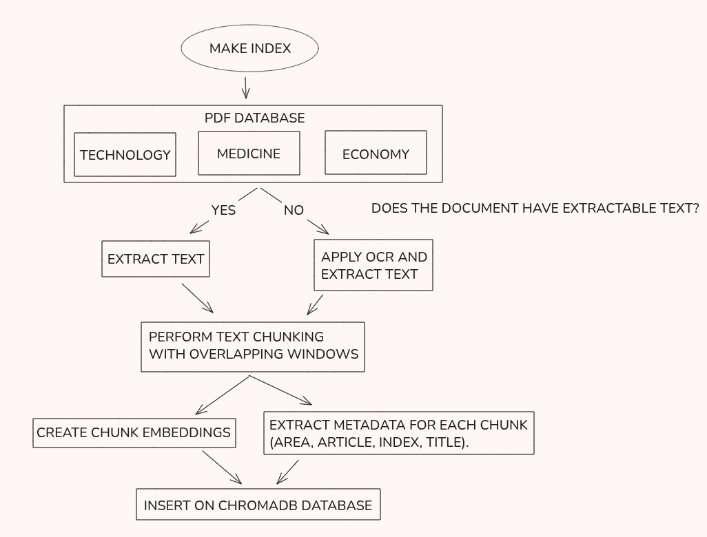
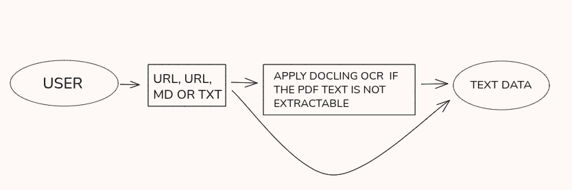
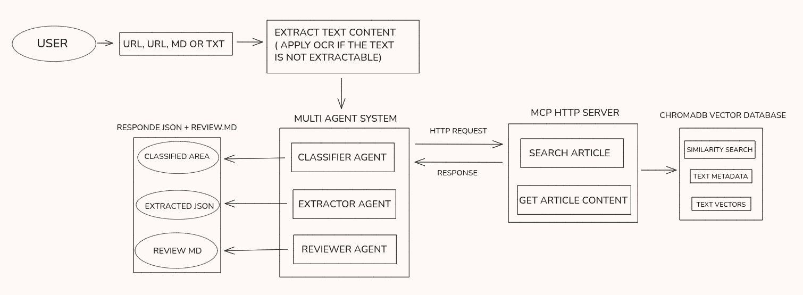
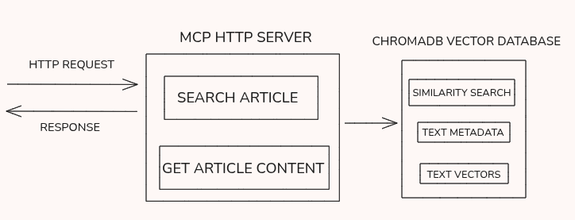

# MOST – Multi-Agent + Vector Store + MCP

Este repositório implementa o desafio técnico da MOST de construir um sistema multi-agente que:

1. Recebe um artigo (PDF local, URL ou texto).
2. Classifica o artigo em uma de três áreas científicas.
3. Extrai um JSON com campos **exatamente** iguais aos do enunciado (incluindo o *typo* em `artcle`).
4. Gera uma resenha crítica em português, apontando pontos fortes, limitações e ameaças à validade.

O sistema é composto por:

- Um **vector store** em ChromaDB com 9 artigos (3 áreas × 3 PDFs por área).
- Um **servidor MCP** expondo o acesso a esse vector store (`search_articles`, `get_article_content`).
- Um **pipeline multi-agente** em LangGraph (classifier → extractor → reviewer).
- Suporte a **OCR opcional** via Docling quando o PDF não tem texto embutido.
- **Testes automatizados** para o vector store e para o pipeline integrado.
- **Makefile**, **Dockerfile** e **docker-compose** para facilitar setup e execução.

---

## 1. Arquitetura em alto nível

Fluxo resumido:

1. **Ingestão de base vetorial**
   - PDFs organizados em `pdf_database/<area>/` (ex.: `economy`, `med`, `tech`).
   - Cada PDF é fatiado em *chunks* (`chunk_size=1000`, `overlap=200`).
   - Embeddings gerados com `sentence-transformers/all-MiniLM-L6-v2`.
   - Tudo é indexado em uma coleção Chroma chamada `articles` em `chroma_db/`.

2. **Servidor MCP (`src/mcp_server/server.py`)**
   - Lê a configuração em `configuration/base.yaml`.
   - Abre o índice Chroma existente.
   - Exibe duas tools via MCP:
     - `search_articles(query: str, top_k: int)` → lista de `{id, title, area, score}`.
     - `get_article_content(article_id: str)` → `{id, title, area, content}`.

3. **Sistema multi-agente (`src/multi_agent_system`)**
   - Implementado com **LangGraph**.
   - Nodes principais:
     - **classifier_node**  
       Classifica o artigo em uma área.  
       Usa:
       - Texto do artigo (truncado a 4000 caracteres).
       - Contexto vindo do MCP (`search_articles` com snippet inicial).
     - **extractor_node**  
       Lê o artigo (com truncamento de segurança) e preenche um JSON com o schema:

       ```json
       {
         "what problem does the artcle propose to solve?": "",
         "step by step on how to solve it": ["", "", ""],
         "conclusion": ""
       }
       ```

       As chaves são **idênticas** às do enunciado, inclusive o `artcle`.
     - **reviewer_node**  
       Usa o JSON extraído + parte do texto do artigo para gerar uma resenha crítica em português (Markdown).

   - O grafo é:  
     `start → classifier → extractor → reviewer → END`.

4. **Entrada do usuário (`scripts/run_agents.py` + `src/pipeline/pipeline_runner.py`)**
   - Aceita:
     - Caminho local para `.pdf`, `.txt` ou `.md`.
     - URL apontando para um PDF.
   - Normaliza a entrada e grava em `samples/input_article_N.ext`.
   - Roda o pipeline multi-agente (`run_pipeline`).
   - Gera:
     - `samples/review_N.md` com a resenha.
     - `samples/output_N.json` com `{area, extraction, review_markdown}`.

---

## 2. Estrutura de diretórios

Visão geral da estrutura:

```text
.
├── chroma_db/               # Onde fica salvo o índice vetorial do ChromaDB
├── configuration/
│   └── base.yaml            # Arquivo central de configuração (paths, vector DB, MCP, LLM etc.)
├── pdf_database/            # Base local de PDFs usados como referência para o vector store
│   ├── economy/             # 3 artigos de economia
│   ├── med/                 # 3 artigos de medicina
│   └── tech/                # 3 artigos de tecnologia
├── samples/                 # Resultados gerados ao rodar o pipeline
│   ├── input_article_N.pdf  # Artigos normalizados (PDF/URL/MD/TXT convertidos)
│   ├── output_N.json        # Saída estruturada (área + JSON extraído + review)
│   └── review_N.md          # Resenha crítica escrita pelo agente
├── src/
│   ├── mcp_server/
│   │   └── server.py        # Servidor MCP com as tools que expõem o vector store
│   ├── multi_agent_system/
│   │   ├── classifier_agent.py   # Agente que classifica a área do artigo
│   │   ├── extractor_agent.py    # Agente que gera o JSON pedido pelo desafio
│   │   ├── reviewer_agent.py     # Agente que escreve a resenha crítica
│   │   ├── graph.py              # Grafo LangGraph que conecta os três agentes
│   │   └── mcp_vector_client.py  # Cliente HTTP que conversa com o servidor MCP
│   ├── pdf_parser/
│   │   └── pdf_parser.py         # Leitor de PDF (PyPDF + OCR Docling quando necessário)
│   ├── pipeline/
│   │   └── pipeline_runner.py    # Classe que orquestra todo o fluxo de execução
│   └── vector_database/
│       ├── vector_database.py    # Implementação do vector store (Chroma + embeddings)
│       └── ingestion_runner.py   # Classe que cuida da ingestão dos 9 PDFs e criação do índice
├── scripts/
│   ├── database_ingestion.py     # Script para reconstruir a base vetorial
│   └── run_agents.py             # Script CLI para rodar o pipeline em um artigo
├── tests/                        # Conjunto de testes automatizados
│   ├── test_vector_database.py
│   └── test_graph_pipeline.py
├── mcp.json                      # Manifesto MCP (para clientes MCP externos)
├── Makefile                      # Comandos principais (setup, index, tests, agents, mcp)
├── Dockerfile                    # Imagem Docker do projeto
├── docker-compose.yml            # Orquestração via Docker Compose
├── requirements.txt              # Dependências Python
└── pytest.ini                    # Configuração do pytest
```

---

## 3. Requisitos

### 3.1. Dependências principais

A execução é pensada para acontecer **dentro de um container Docker**. No host você precisa apenas de:

- Docker
- Docker Compose
- Uma variável de ambiente ou arquivo `.env` com:

  ```bash
  GROQ_API_KEY=<sua_chave_da_groq>
  ```

Opcionalmente, se estiver rodando em uma máquina com GPU e CUDA configurados, o PyTorch e o `sentence-transformers` vão utilizá-la automaticamente dentro do container.

### 3.2. Variáveis de ambiente

Na raiz do projeto, crie um `.env` com:

```bash
echo "GROQ_API_KEY=SEU_TOKEN_AQUI" > .env
```

O `docker-compose.yml` já está configurado para carregar esse `.env` para o container.

---

## 4. Execução com Docker e docker-compose

Toda a instalação de dependências, construção do índice vetorial e execução do pipeline acontece **dentro** do container.

### 4.1. Build da imagem

Na raiz do projeto:

```bash
docker compose build
```

### 4.2. Entrar no container

Para abrir um shell dentro do container:

```bash
docker compose run --rm most-app bash
```

Você estará em `/app` dentro do container, com o código montado via volume.


## 5. Construindo o vector store (ingestão dos 9 artigos)



Ainda **dentro do container**, use:

```bash
make index
```

O alvo `index` faz:

1. Limpeza da pasta `chroma_db/` (se existir).
2. Reconstrução completa do índice vetorial chamando `scripts.database_ingestion`.

Internamente:

1. Lê `configuration/base.yaml`.
2. Descobre `pdf_database/` e `chroma_db/`.
3. Cria uma instância de `VectorDatabase` com:
   - `embedding_model="sentence-transformers/all-MiniLM-L6-v2"`
   - `chunk_size=1000`
   - `chunk_overlap=200`
4. Percorre cada subpasta de `pdf_database`:
   - Cada PDF é lido, extraído como texto, chunkado e indexado.
5. Grava os embeddings e metadados em Chroma (persistindo em `/app/chroma_db`, montado no host).

---

## 6. OCR e extração de texto de PDFs



A classe `PdfTextExtractor` (`src/pdf_parser/pdf_parser.py`) implementa:

1. **Extração com PyPDF**
   - Usa `pypdf.PdfReader` e `page.extract_text()` página a página.
   - Se conseguir extrair texto, retorna esse conteúdo.

2. **Fallback com OCR via Docling (opcional)**
   - Se **nenhum texto** for encontrado com PyPDF e `enable_ocr=True`, tenta OCR.
   - Usa `docling.document_converter.DocumentConverter().convert(...)`.
   - Chama `export_to_text()`.
   - Se ainda assim não houver texto, lança `ValueError`.

Na pipeline, o OCR está habilitado por padrão para arquivos `.pdf`.

---

## 7. Pipeline multi-agente (LangGraph)



O grafo está em `src/multi_agent_system/graph.py`. Componentes:

- **Classifier Agent (`classifier_agent.py`)**
  - Descobre as áreas listando subpastas em `pdf_database/` (ex.: `economy`, `med`, `tech`).
  - Trunca o texto do artigo em `max_article_chars` (4000 caracteres).
  - Usa o cliente MCP (`MCPVectorStoreClient`) para chamar `search_articles` com snippet inicial (`mcp_query_chars`, 800 caracteres).
  - Monta um contexto textual com os hits do vector store.
  - Chama o LLM Groq com:
    - Prompt de sistema configurado em `MultiAgentConfig`.
    - Mensagem humana contendo artigo truncado + lista de artigos similares.
  - Normaliza a saída para uma área conhecida (match exato, substring, sinônimos tipo “econ”).

- **Extractor Agent (`extractor_agent.py`)**
  - Recebe `article_text` (e opcionalmente `area`).
  - Trunca o texto para `max_article_chars` (6000).
  - Instrui o LLM a devolver **apenas** JSON.
  - Usa `_extract_json_from_response` para suportar:
    - JSON cru.
    - Blocos ```json ... ```.
  - Usa `_normalize_extraction` para garantir:

    ```json
    {
      "what problem does the artcle propose to solve?": "string",
      "step by step on how to solve it": ["string", "..."],
      "conclusion": "string"
    }
    ```

- **Reviewer Agent (`reviewer_agent.py`)**
  - Recebe `area`, `extraction` e `article_text`.
  - Serializa `extraction` para JSON string.
  - Trunca o artigo em ~4000 caracteres para contexto opcional.
  - Gera resenha crítica em português, com foco em:
    - Novidade / contribuição.
    - Método / desenho experimental.
    - Validade dos resultados.
    - Ameaças à validade e replicabilidade.

- **Grafo (`graph.py`)**
  - Estado: `{"article_text", "area", "extraction", "review"}`.
  - Ordem:
    - `start → classifier → extractor → reviewer → END`.
  - Função pública:
    - `run_pipeline(article_text: str) -> Dict[str, Any]`.

---

## 8. Servidor MCP



Em `src/mcp_server/server.py`:

- Lê `configuration/base.yaml`:
  - Configura `pdf_root`, `chroma_path`.
  - Configura `embedding_model`, `collection_name`, `chunk_size`, `chunk_overlap`.
  - Configura `mcp.name`, `mcp.transport`.
- Instancia `VectorDatabase` com essas configurações.
- Cria servidor `FastMCP` com `json_response=True`.
- Tools expostas:

```python
@mcp.tool()
def search_articles(query: str, top_k: int = 5) -> List[Dict[str, Any]]:
    ...
```

```python
@mcp.tool()
def get_article_content(article_id: str) -> Dict[str, Any]:
    ...
```

### 8.1. Manifest MCP (`mcp.json`)

`mcp.json` define:

- Nome, label, versão e descrição do servidor.
- Como iniciar via STDIO:

```jsonc
{
  "servers": [
    {
      "name": "stdio",
      "transport": "stdio",
      "command": "python",
      "args": ["-m", "src.mcp_server.server"],
      "env": {
        "PYTHONPATH": "."
      }
    }
  ],
  "tools": [
    { "name": "search_articles", ... },
    { "name": "get_article_content", ... }
  ]
}
```

Isso é utilizado por clientes MCP externos (por exemplo, ChatGPT ou IDEs) para descobrir como falar com o servidor dentro do container.

### 8.2. Cliente MCP interno (`MCPVectorStoreClient`)

`src/multi_agent_system/mcp_vector_client.py`:

- Usa `mcp.ClientSession` + `stdio_client` para lançar o servidor MCP como subprocesso:
  - Comando padrão: `python -m src.mcp_server.server 2>/dev/null`.
- Métodos públicos:
  - `search_articles(query: str, top_k: int)`.
  - `get_article_content(article_id: str)`.

Ou seja, os agentes internos não acessam diretamente a `VectorDatabase`; tudo passa pelas tools MCP.

---

## 9. CLI de execução do pipeline (utilizar o make file explicado na sequência)

`src/pipeline/pipeline_runner.py`:

- `ArticleSampleManager`:
  - Lê `samples/output_N.json` para descobrir próximo índice.
  - Copia arquivos locais ou baixa URLs para `samples/input_article_N.ext`.
  - Calcula paths para `review_N.md` e `output_N.json`.

- `ArticlePipelineRunner`:
  - Resolve source → normaliza entrada → lê texto.
  - Chama `run_pipeline(article_text)`.
  - Salva `review_N.md` e `output_N.json`.
  - Retorna metadados da execução.
```

---

## 10. Testes automatizados

### 10.1. Rodando os testes (dentro do container)

Com `GROQ_API_KEY` disponível no ambiente (via `.env`):

```bash
make test
```

O alvo `test`:

1. Reconstrói a base vetorial (`scripts.database_ingestion`).
2. Roda `pytest`.

### 10.2. Testes

- `tests/test_vector_database.py`:
  - Testa chunking, `search_articles` e `get_article_content`.
- `tests/test_graph_pipeline.py`:
  - Integração completa do grafo (`run_pipeline`) em um PDF.
  - Pula se `GROQ_API_KEY` não estiver setada.

---

## 11. Makefile

Os principais alvos disponíveis **dentro do container**:

```text
make help
```

- `make index`  
  Limpa a pasta `chroma_db/` e reconstrói todo o índice vetorial a partir de `pdf_database/`.

- `make test`  
  Reconstrói o índice e roda `pytest`.

- `make agent SOURCE=...`  
  Roda o pipeline multi-agente em um artigo (arquivo local ou URL).  
  Exemplos:

  ```bash
  make agent SOURCE="samples/input_article_1.pdf"
  make agent SOURCE="https://exemplo.com/artigo.pdf"
  ```

- `make mcp`  
  (Opcional) Sobe o servidor MCP em background dentro do container, gravando o PID em `.mcp_server.pid`. Isso é útil apenas se você quiser conectar um cliente MCP externo (como ChatGPT) ao servidor rodando no container.

- `make stop-mcp`  
  Encerra o servidor MCP que foi iniciado com `make mcp`.

---

## 12. Docker e docker-compose

Resumo do fluxo usando Docker:

1. **Build da imagem** (no host):

   ```bash
   docker compose build
   ```

2. **Entrar no container** (no host):

   ```bash
   docker compose run --rm most-app bash
   ```

3. **Dentro do container** (em `/app`):

   ```bash

   # 1) Construir o índice vetorial em chroma_db/
   make index

   # 2) Rodar o pipeline em um artigo de exemplo
   make agent SOURCE="samples/input_article_1.pdf"

   # 3) Opcional: rodar testes
   make test

   # 4) Opcional: subir servidor MCP em background para clientes externos
   make mcp
   # ... usar a partir de um cliente MCP externo ...
   make stop-mcp
   ```

A pasta `/app/chroma_db`, `/app/samples` e `/app/pdf_database` são montadas como volumes do host, então os artefatos gerados dentro do container aparecem na árvore local do projeto.

---

## 13. Resumo rápido

1. Criar `.env` com a chave (no host):

   ```bash
   echo "GROQ_API_KEY=SEU_TOKEN_AQUI" > .env
   ```

2. Construir a imagem Docker (no host):

   ```bash
   docker compose build
   ```

3. Entrar no container:

   ```bash
   docker compose run --rm most-app bash
   ```

4. Dentro do container, instalar dependências e construir o índice:

   ```bash
   make index
   ```

5. Rodar o pipeline em um sample:

   ```bash
   make agent SOURCE="samples/input_article_1.pdf"
   ```

6. Conferir saídas (a partir do host ou do container):

   - `samples/output_N.json`
   - `samples/review_N.md`

# 14. Configuração detalhada (`base.yaml`) — explicação dos parâmetros

A seguir está uma explicação clara e objetiva sobre **o que cada campo da configuração faz** e **por que foi escolhido desse jeito** dentro do sistema.

## **Bloco `mcp`: parâmetros do servidor MCP**

```yaml
mcp:
  name: "ArticleVectorStore"
  transport: "http"
  host: "0.0.0.0"
  port: 8000
  base_url: "http://127.0.0.1:8000"
```

### ✦ `name: "ArticleVectorStore"`
Nome lógico do servidor MCP.  
É usado apenas para identificação por clientes MCP externos.  
Escolhemos esse nome porque o servidor expõe exatamente um vector store de artigos.

### ✦ `transport: "http"`
Define que o MCP roda como **servidor HTTP**, e não STDIO.  
Isso permite que o multi-agent system converse com o MCP via requisições HTTP normais — mais simples, mais previsível e mais fácil para debugar.

### ✦ `host: "0.0.0.0"`
Faz o servidor escutar em todas as interfaces de rede do container.  
É necessário para que o multi-agent system consiga atingir o MCP mesmo estando em processos separados.

### ✦ `port: 8000`
Porta padrão do servidor FastAPI/uvicorn no projeto.

### ✦ `base_url: "http://127.0.0.1:8000"`
URL usada pelo cliente MCP (`MCPVectorStoreClient`) para enviar requisições.  
Mesmo o host real sendo `0.0.0.0`, o cliente se conecta a `127.0.0.1` dentro do container.

## **Bloco `paths`: caminhos principais**

```yaml
paths:
  pdf_root: pdf_database
  chroma_path: chroma_db
```

### ✦ `pdf_root`
Diretório onde ficam os 9 PDFs usados para construir o vector store.  
Escolhemos uma estrutura `<area>/<pdf>` porque o classificador descobre as áreas automaticamente listando as subpastas.

### ✦ `chroma_path`
Diretório onde o ChromaDB salva seu banco vetorial persistente.  
Mantido simples e na raiz do projeto para facilitar versionamento e limpeza com `make index`.

## **Bloco `vector_db`: parâmetros do vetor store**

```yaml
vector_db:
  embedding_model: sentence-transformers/all-MiniLM-L6-v2
  collection_name: articles
  chunk_size: 1000
  chunk_overlap: 200
```

### ✦ `embedding_model: all-MiniLM-L6-v2`
Modelo rápido, leve e altamente recomendado para **similaridade semântica**.  
Motivações:
- 100x mais leve que modelos grandes
- Embeddings muito bons para artigos curtos
- Latência baixa, ideal para pipelines multi-agente

### ✦ `collection_name: articles`
Nome da coleção no ChromaDB.  
Mantivemos `articles` pois o conteúdo armazenado é exclusivamente de artigos científicos.

### ✦ `chunk_size: 1000`  
Cada PDF é dividido em pedaços de até 1000 caracteres.  
Esse tamanho é um balanço ideal entre:
- contexto suficiente por chunk  
- boa granularidade para busca vetorial  
- velocidade na geração dos embeddings  

### ✦ `chunk_overlap: 200`  
Overlap de 20% entre chunks.  
Escolhido para evitar perda de contexto entre quebras — especialmente importante em PDFs longos.

## **Bloco `multi_agent`: configuração dos agentes LLM**

```yaml
multi_agent:
  llm:
    provider: groq
    model: openai/gpt-oss-120b
    temperature: 0.0
```

### ✦ `provider: groq`
Usamos **Groq** por ser extremamente rápido, reduzindo latência do pipeline.

### ✦ `model: openai/gpt-oss-120b`
Modelo OSS acelerado pela Groq, com ótimo equilíbrio entre:
- custo
- velocidade
- capacidade de raciocínio

Empiricamente, foi o que gerou resultados mais consistentes no classificador, extractor e reviewer.

### ✦ `temperature: 0.0`
Comportamento totalmente determinístico.  
Fundamental para:
- testes automatizados funcionarem sempre igual  
- JSON ser extraído sem variação de estrutura  
- classificação não oscilar entre execuções

## **Prompts dos agentes**

### **Classifier Prompt**
Focado em escolher **apenas uma** das três áreas.  
Tem acesso ao resultado de `search_articles()`, incentivando uso de contexto real do vector store.

### **Extractor Prompt**
Força o LLM a devolver **somente** o JSON com:
- chaves idênticas ao enunciado
- formato rígido
- assertividade no passo a passo

O “typo” em `artcle` é preservado para seguir o enunciado oficial.

### **Reviewer Prompt**
Gera uma resenha crítica completa em **português brasileiro**, com oito seções obrigatórias.  
Também orienta o modelo a identificar quando o artigo é “fora da área”, respeitando o comportamento do classificador.

## **Dependências principais e justificativas**

### **groq**
LLM de baixa latência → reduz o tempo de resposta do pipeline.

### **chromadb**
Vector store simples e eficiente, com API Python direta.

### **sentence-transformers**
Gera embeddings de alta qualidade para busca semântica.

### **pypdf**
Primeiro estágio de extração de texto — rápido e sem dependências nativas.

### **docling**
OCR moderno usado como fallback para PDFs que não têm texto embutido.

### **easyocr**
Dependência complementar usada internamente pelo Docling em alguns cenários.

### **langgraph**
Permite montar o pipeline de agentes com fluxo determinístico e reproducível.

### **langchain-groq**
Driver Groq para facilitar chamadas LLM.

### **fastapi + uvicorn**
Infra leve para o servidor MCP via HTTP.

### **pydantic**
Validação rigorosa para todas as requests/responses do MCP.

### **pytest**
Testes automatizados para vector store e pipeline multi-agente.